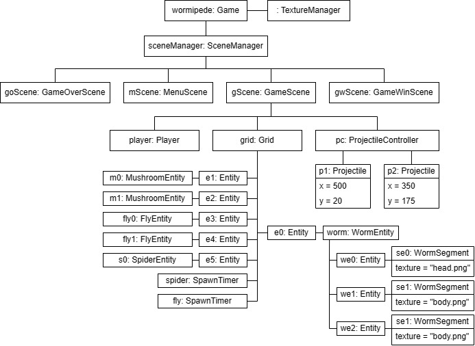

<p align="center">
  
  
</p>

## What is Wormipede?

The project was developed as part of the 'Programmieren in C++' module at the Berlin School of Economics and Law (HWR
Berlin).\
Wormipede is a game inspired by the 1981 classic Centipede. You are a wizard in search of the magical hibiscus flower.
You have heard of its powers, when brewed into a potion, to vanquish all the evil insects from your garden. After hours
of searching through the dark forest, you finally find the flower. But when you return home and enter your garden, the
ground beneath you begins to tremble. The worm is awakening! You must stop the worm and other insects from reaching the
flower and destroying it. Use your magic to stop them!

## How to play

- Navigate the menus by clicking the buttons with the mouse
- Move the player with the arrow keys
- Shoot with the space key
- Stop the insects and worm from reaching the bottom of the screen

## Prerequisites

- CMake 3.11 or later

## Build

### Linux

```bash
sudo apt update 
sudo apt-get install libx11-dev libgl1-mesa-dev libopenal-dev libvorbis-dev libflac-dev libudev-dev libxrandr-dev libxcursor-dev libfreetype6-dev build-essential cmake
cmake -S . -B build/ -D CMAKE_BUILD_TYPE=Release
cmake --build build/
```
The game can be run by executing the `Wormipede` executable in the `build/bin` directory. \
Note that the game has been tested and compiled on Ubuntu 20.04 (WSL).

### Windows

Make sure to have Visual Studio (e.g. 2022 Community) installed with the C++ development tools. Then run the following
commands in the command prompt:

```bash
cmake -G "Visual Studio 17 2022" -A x64 -S . -B "build64" #64-bit build
cmake --build build64 --config Release
cd build64/bin7
mv .\assets\ .\Release\
```
The game can be run by executing the `Wormipede.exe` executable in the `build64/bin/Release` directory.

## Development

The game is written in C++ using the SFML2 library for graphics and input handling. The game is structured using a
scene-based architecture, where each scene represents a different screen in the game, such as the main menu, gameplay
and game-over screens. These are managed using the `SceneManager` class. The game loop is controlled by the `Game`
class,
which updates and renders the current scene. The gameplay logic is contained in the `GameplayScene` class, which handles
player movement, entity movement, bullet firing and collision detection. The player character is represented by
the `Player` class. All of the enemy entities are represented by a class of their own, which inherits from the `Entity`
class. All entities are placed on a grid represented by the `Grid` class, which handles collision detection and entity
movement. The player can also fire projectiles to destroy enemy entities, which are represented by the `Projectile`
class and managed by the `ProjectileController` class. Because of the dynamic entity creation, the `TextureManager`
class is used to load and store textures for the entities.\
The game is built using the CMake build system, which allows for easy compilation and linking of the game code and
dependencies.

### Object Diagram

In this UML object diagram the basic structure of the game is shown:


## Known Issues

- The worm sometimes goes down two spaces, which causes the tail to orientate incorrectly
